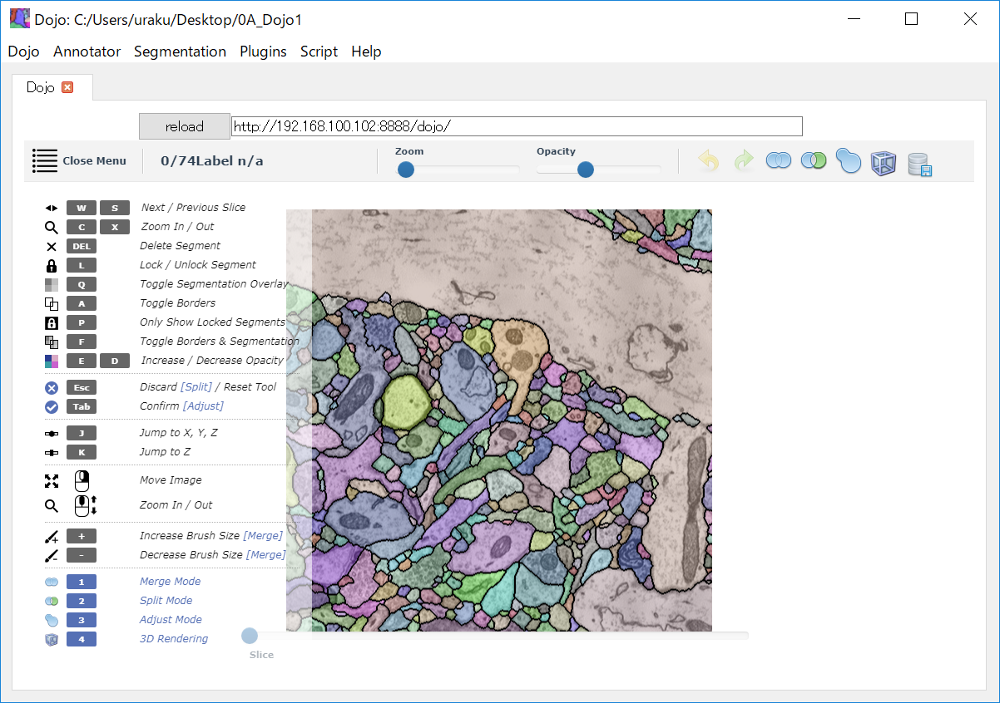
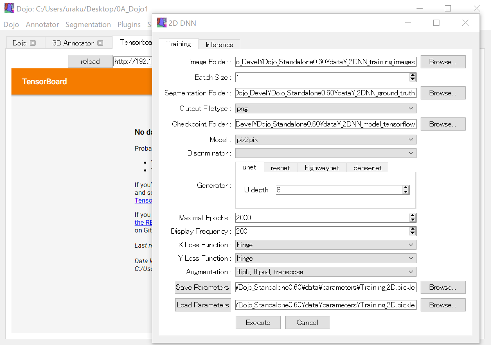

[English version here](HowToUse.md)

- [使い方：校正ソフトウェアDojo](HowToUse.ja.md#校正ソフトウェアDojo)
- [使い方：3D Annotator](HowToUse.ja.md#3D-Annotator)
- [使い方：2次元DNNを用いたセグメンテーション](HowToUse.ja.md#2次元DNNを用いたセグメンテーション)
- [使い方：3次元FFNを用いたセグメンテーション](HowToUse.ja.md#3次元FFNを用いたセグメンテーション)
- [使い方：2D/3Dフィルタ](HowToUse.ja.md#2D3Dフィルタ)
- [適用事例1：2次元DNNによるミトコンドリアのセグメンテーション](Workflow1.ja.md)
- [適用事例2：3次元FFNによる細胞膜のセグメンテーション](Workflow2.ja.md)

## 使い方：

### 校正ソフトウェアDojo：
自動セグメンテーション結果を確認・校正するためのツールです。Lichtman/Pfister 研が開発した Rhoana piplineの一部です。

	- https://www.rhoana.org/dojo/

1. 上端のドロップダウンメニューより一番左のDojo → Open Dojo Folderを選択して、ダイアログよりkasthuri15フォルダ下のmojoを指定してください。サンプルデータがダウンロードされてDojoが起動します。
2. Dojoはコントロールパネル内のWebブラウザ (Chromium/PyQt5) で動作します。動作がおかしいと思ったら、Reloadボタンを押してWebブラウザをリフレッシュしてださい。上部URL [ http://X.X.X.X:8888/dojo/ ] をコピーして、Chromeなどの他のWebブラウザのアドレスバーにペーストすると、そこでDojoが起動します。同じLAN内の他のPCにおいてもWebブラウザ上でDojoが起動するはずです。起動しない場合は、ファイアウォールを停止してみてください。
3. Dojoの使い方は基本的にはDojoオリジナルページ [ http://www.rhoana.org/dojo/ ]に従います。例えばw/sキーでzレイヤ間を移動し、e/dキーでセグメンテーションの透過度を変更します。
4. 新しいEM画像を編集する場合は、ドロップダウンメニュー Dojo → Import EM stackを選択して、tiff/pngの連続番号EM画像・Segmentation画像ファイルが入ったフォルダを指定してください **[実装予定；マルチページtiff画像読込 19/2/1]** 。
5. 編集後はドロップダウンメニュー Dojo → Export EM Stack / Export Segmentationを選択することにより、tiff/pngの連続番号ファイルして保存することができます。

 

  

 

### 3D Annotator：
Dojoファイルを開いた状態で、 上端のドロップダウンメニュー左から二番目のAnntator → Openを選択してください。3D Annotatorが起動します。
1. 右Object Tableの赤いX印(Visible)をクリックすると該当するIDのオブジェクト（セグメント）が表示されます。Object TableのSize欄をクリックしてSize順に並び替え、Size の大きなオブジェクトを表示するとわかりやすいです。
	- 左表示パネル上、マウスの左ボタンを押した状態でドラックすることにより、オブジェクトの移動・回転ができます。
	- 右Object Table上で名前(Name)と色(RGB)の変更ができます。
	- テーブル下"Download JSON"ボタンをクリックすることで、テーブルの内容をJSON形式で保存できます **[CSV形式に変更予定 19/2/1]**。
	- 右上段アコーディオンメニューのAppearanceを開くことで、背景色（白黒）の変更、境界ボックスの表示、オブジェクトへの照明強度の変更ができます。
2. 右上段アコーディオンメニューMarker labelを開いて最上段のトグルボタンをONにしてください。その状態で左表示パネルのオブジェクトをクリックすると、赤色のマーカーを付与することができます。表示されたマーカーは、右Marker Tableに登録されます。
	- アコーディオンメニューMarker labelより、付与するマーカーの半径(Radius)、色(RGB)、名前(Prefix)、名前番号(Suffix)を変更できます。
	- 右Marker Table上で付与されたマーカーの名前(Name)、半径(Radius)、色(RGB)の変更、マーカーの消去(Delete)ができます。
	- テーブル下"Download JSON"ボタンをクリックすることで、テーブルの内容をJSON形式で保存できます **[CSV形式に変更予定 19/2/1]**。
3. 右上段アコーディオンメニューのSave imageをクリックすることで、左表示パネルにおける表示内容が"Screenshot.png"として保存されます。

 

  

 

### 2次元DNNを用いたセグメンテーション：
コントロールパネルからResNet/U-net/Highwaynet/Densenet に基づいて2次元EM画像のセグメンテーションを行うことができます。U-netは空間高周波数の境界部分と大域的な特徴の両方を同時に抽出することのできる優れたCNNです。Torsten Bullmann博士が実装を行いました。
	- <https://github.com/tbullmann/imagetranslation-tensorflow>

1. Vast liteを利用するなどして ( https://software.rc.fas.harvard.edu/lichtman/vast/ )、EM画像から正解セグメンテーション（ground truth）を作成してください。EM画像、Segmentation画像のペアとして、Dojo-standalone/data/_2DNN_training_imagesおよびDojo-standalone/data/ _2DNN_ground_truth_imagesフォルダに保存してください。画像フォーマットはどちらもgray scale png, tiffとしてください。
2. コントロールパネル上端のドロップダウンメニューよりSegmentation → 2DNNを選択して、Training, Inferenceの2つのタブを持つダイアログを起動してください。
3. Trainingタブを選択し各パラメータを設定してください **[参考]** ：
	- Image Folder 入力EM画像のtiff/png連続番号ファイルの入ったフォルダ
	- Segmentation Folder 正解セグメンテーション画像のtiff/png連続番号ファイルの入ったフォルダ
	- Checkpoint	トレーニングしたDNNの結合強度を保存するフォルダ
	- X loss		損失関数　"hinge", "square", "softmax", "approx", "dice", "logistic"
	- Y loss		損失関数　"hinge", "square", "softmax", "approx", "dice", "logistic"
	- Model		学習モデルの指定 "pix2pix", "pix2pix2", "CycleGAN"
	- Generator	DNNトポロジの指定 "unet", "resnet", "highwaynet", "densenet"
	- Augmentation	トレーニングデータ水増し方向の設定 {fliplr  ,flipud, transpose} 
	- Maximal epochs	トレーニング回数	
	- Display Frequency 	指定回数に一度Inferenceを行い、結果をCheckpointにhtml形式で出力する。
	- Save Parameters	上記パラメータを指定ファイルに保存します。
	- Load Parameters	上記パラメータを指定ファイルから読み出します。

4. Executeボタンをクリックしてトレーニングを開始します。既定パラメータにて、サンプルEM画像データDojo_Standalone/data/_2DNN_training_images および サンプルSegmentation画像Dojo_Standalone/data/_2DNN_ground_truth/49_memb.png を対象にトレーニングを行います。
5. プルダウンメニューよりSegmentation → Tensorboradを選択して、トレーニングの進捗を確認してください。既定パラメータにてサンプルEM/Segmentation画像のトレーニングを行った場合、NVIDIA GeForce GTX 1070 で5分程度かかりました。
6. コマンドプロンプトに"saving model"と表示されたらトレーニング終了です。
7. Checkpointフォルダに "model-XXXXX.data-XXXXX-of-XXXXX" (800 MB) が出力されていることを確認してください。このファイルにトレーニング結果が保存されています。
8. Segmentation → ２DNNを選択して、さらにInferenceタブを選択し各パラメータを設定してください。
	- Image Folder	入力EM画像のtiff/png連続番号ファイルの入ったフォルダ
	- Output Segmentation Folder 出力セグメンテーション画像を保存するフォルダの指定
	- Checkpoint トレーニングしたDNNの結合強度ファイル"model.ckpt-XXXX.data-YYYY-of-ZZZZ" の指定 (X,Y,Zは数字）。ファイル名が指定されない場合は、指定フォルダ内でもっとも大きな番号をもつ"model.ckpt "が選択されます。

9. Executeボタンをクリックして推定を開始します。
10. 推定結果はデフォルトでDojo_Standalone/data/_2DNN_inferenceに保存されます 。

 

  

 

### 3次元FFNを用いたセグメンテーション
Michał Januszewski 博士らが開発した、Flood filling network (FFN)に基づいています。FFNはPaintルーチンのアルゴリズムを基盤として、境界を3D DNNにより決定する細胞膜専用のセグメンターです。 **[実装しました。使用方法は英語ページをご覧ください]** 

 <https://github.com/google/ffn>

同手法により、これまで最も性能が出る方法とされた 二次元 U-Net によるセグメンテーションと GALAの組み合わせより、はるかに高い正確さでセグメンテーションを行うことができるようになりました。ただし、3次元のお手本を準備する必要があります。また、長いトレーニング期間が必要です。例えば、NVIDIA GeForce GTX 1080 ti使用した場合で約2週間かかります。

1. Vast liteを利用するなどして ( https://software.rc.fas.harvard.edu/lichtman/vast/ )、EMスタック画像から正解セグメンテーション（ground truth）を作成してください。EM連番スタック画像、Segmentation連番スタック画像のペアとして、Dojo-standalone/data/_3DNN_training_imagesおよびDojo-standalone/data/ _3DNN_ground_truthフォルダに保存してください。画像フォーマットはどちらもgray scale png, tiffとしてください。
2. コントロールパネル上端のドロップダウンメニューよりSegmentation → 2D FFNを選択して、Preprocessing, Training, Inference, Postprocessingの4つのタブを持つダイアログを起動してください。

### 2D/3Dフィルタ
2Dスタック画像を対象とした、各種の2D/3Dフィルタ関数が実装されています。
上端のドロップダウンメニュー左から四番目のPlugins → 2D Filters, 2D Watershed, 3D Filtersを選択してください。各フィルタのダイアログが起動します。特に2D DNN セグメンテーション適用後の後処理に使用することを想定しています。順次機能拡張予定です。

