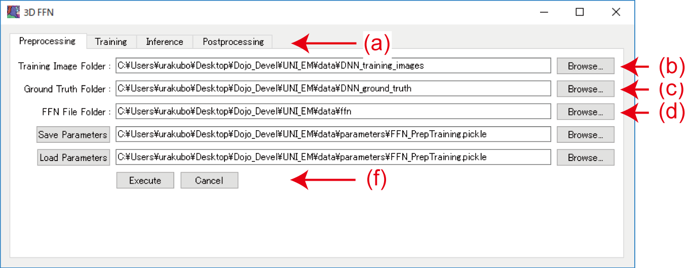
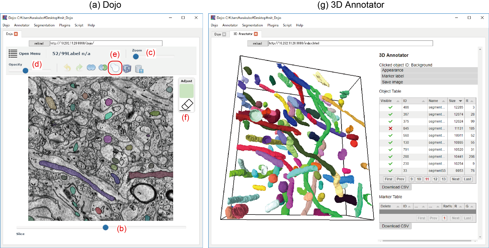

[English version here](Workflow2.md)

- [使い方：校正ソフトウェアDojo](HowToUse.ja.md#校正ソフトウェアDojo)
- [使い方：3D Annotator](HowToUse.ja.md#3D-Annotator)
- [使い方：2次元DNNを用いたセグメンテーション](HowToUse.ja.md#2次元DNNを用いたセグメンテーション)
- [使い方：3次元FFNを用いたセグメンテーション](HowToUse.ja.md#3次元FFNを用いたセグメンテーション)
- [使い方：2D/3Dフィルタ](HowToUse.ja.md#2D3Dフィルタ)
- [適用事例1：2次元DNNによるミトコンドリアのセグメンテーション](Workflow1.ja.md)
- [適用事例2：3次元FFNによる細胞膜のセグメンテーション](Workflow2.ja.md)

## 適用事例2:  3次元FFNによる細胞膜のセグメンテーション

UNI-EMによる3D FFNセグメンテーションの一例として、ATUM/SEMによって連続断層撮影されたMouse somatosensory cortexの細胞膜のセグメンテーションを試みます。EM画像は ISBI 2013 challenge ([SNEMI3D](http://brainiac2.mit.edu/SNEMI3D/)) のために作られたものをそのまま使用させて頂きました。同画像を用いた論文は Kasthuri et al. ( Cell 162(3):648-61, 2015 ) に出版されており、 Open Data Commons Attribution License (ODC-By) v1.0 ライセンスのもと公開されています。EM画像には、使用前に Contrast Limited Adaptive Histogram Equalization (CLAHE)フィルタを通しました (blocksize 127, histogram bins 256, max slope 1.50) 。

- https://neurodata.io/data/kasthuri15/
- https://opendatacommons.org/licenses/by/1-0/
- http://docs.neurodata.io/kasthuri2015/kasthuri15docs.html


#### ●EM画像と教師セグメンテーション

1. 下の ExampleFFN.zip をダウンロードして展開してください。dataフォルダの中身をUNI-EMフォルダ（[UNI-EM]）中のdataフォルダに置いてください。"[UNI-EM]/data/_3DNN_training_images" にトレーニング画像 (0000.png, ..., 0099.png; 8bit, grayscale png) 、"[UNI-EM]/data/_3DNN_ground_truth" に教師セグメンテーション (0000.png, ..., 0099.png; 16bit, grayscale png) が入っています(**Fig. 1**)。教師セグメンテーションの作成にはVast liteの使用をお勧めします
( https://software.rc.fas.harvard.edu/lichtman/vast/ )。

**ExampleFFN.zip** 522MB: https://www.dropbox.com/s/cztcf8w0ywj1pmz/ExampleFFN.zip?dl=0

<BR>
<p align="center">
  
</p>
<p align="center">
  <font size="5"> <b>Figure 1. Training EM image and membrane ground truth segmentation</b> </font>
</p>
<BR>


#### ●前処理

2. UNI-EMを起動してください。

3. UNI-EM上端のドロップダウンメニューより Segmentation → 3D FFN を選択して、3D FFN ダイアログを起動してください。
	- Preprocessing タブを選択してください(**Fig. 2a**)。
	- Training Image Folder "[UNI-EM]/data/_3DNN_training_images" にEM画像が存在すること(**Fig. 2b**)、Ground Truth Folder "[UNI-EM]/data/_3DNN_ground_truth"に教師セグメンテーション画像が存在することを確認してください(**Fig. 2c**)。同様にFFN File Folder ("[UNI-EM]/data/ffn") が存在することを確認してください(**Fig. 2d**)。左側のサムネイルにTraining Imageが、右側にGround Truthが表示されます(**Fig. 2e**)。

4. Preprocessing タブ最下段の Execute をクリックして、前処理ファイルの作成を開始してください(**Fig. 2f**)。FFN File Folderに次の４つのファイルが作成されます。作成時間は6-60分です。コンソールに下の様なプログレスメッセージが現れます。
	- EM画像のhdf5ファイル"grayscale_maps.h5"
	- 教師セグメンテーション画像のhdf5ファイル"groundtruth.h5"
	- FFN中間ファイル"af.h5"
	- FFN中間ファイル"tf_record_file"

```Preprocessing
        "grayscale_maps.h5" file (training image) was generated.
	"groundtruth.h5" file (ground truth) was generated.
	FFN Preparation
	Start compute_partitions.
	I0217 21:49:47.965403 20392 compute_partitions.py:189] Done processing 2
	I0217 21:49:49.039531 20392 compute_partitions.py:189] Done processing 3
        ...
	I0217 21:52:07.314850 20392 compute_partitions.py:191] Nonzero values: 8875887
	Start build_coordinates.
        ...
	I0217 21:52:10.161867  4268 build_coordinates.py:76] Partition counts:
	I0217 21:52:10.161867  4268 build_coordinates.py:78]  0: 2319505
	I0217 21:52:10.162837  4268 build_coordinates.py:78]  1: 22446
        ...
	I0217 21:52:10.164829  4268 build_coordinates.py:78]  13: 71675
	I0217 21:52:10.164829  4268 build_coordinates.py:80] Resampling and shuffling coordinates.
	I0217 21:52:38.350505  4268 build_coordinates.py:88] Saving coordinates.
```

<BR>
<p align="center">
  
</p>
<p align="center">
  <font size="5"> <b>Figure 2. Preprocessing of FFN</b> </font>
</p>
<BR>


#### ●トレーニング

5. FFNダイアログのTrainingタブを選択してください(**Fig. 2a**)。
	- Max Training Steps を設定してください。正確な推論のためには数百万ステップ以上のトレーニングが必要です。NVIDIA GTX1080tiを用いた場合で一週間以上かかります。ただし、Training 中は約3000ステップごとにtensorflowモデルが出力され、途中でトレーニングを止めた場合でも新たにTrainingを開始すると "[UNI-EM]/data/_3DNN_model_tensorflow” から最新のモデルを読み込み、そこからトレーニングを再開します。Max Training Steps に達するとモデルを出力してトレーニングは終了します。推論結果よりトレーニング不足であった場合は、さらに大きな Max Training Stepsを設定してトレーニングを再実行（再開）します。
	- xyピッチ(nm/pixel)に比べてz方向のピッチ(nm/pixel)が大きい場合はSparse Zにチェックを入れてください。チェックの有無でFFNトレーニングパラメータが次のように変わります。
		- チェックを入れない場合：　"depth":12,"fov_size":[33,33,33],"deltas":[8,8,8]
		- チェックを入れた場合："depth":9,"fov_size":[33,33,17],"deltas":[8,8,4]

	- Ground Truth h5 File, Tensorflow Record File, Tensorflow Record File が前処理したファイルを指定していることを確認してください。
	- Tensorflow Model Folder に空フォルダが指定されていることを確認してください。

6. Trainingタブ最下段の Execute をクリックして、トレーニングを開始してください。コンソールに次の様なプログレスメッセージが現れます。
```FFN Training
        ...
	INFO:tensorflow:global_step/sec: 9.96695
	I0217 23:14:35.690611  2272 tf_logging.py:115] global_step/sec: 9.96695
	INFO:tensorflow:global_step/sec: 9.93734
	I0217 23:14:45.753664  2272 tf_logging.py:115] global_step/sec: 9.93734
	INFO:tensorflow:Saving checkpoints for 5724 into C:[UNI-EM]\data\_3DNN_model_tensorflow\model.ckpt.
	I0217 23:14:48.400605  2272 tf_logging.py:115] Saving checkpoints for 5724 into C:[UNI-EM]\data\_3DNN_model_tensorflow\model.ckpt.
I0217 23:14:48.805234  2272 train.py:699]
        ...
```

#### ●推論

7. FFNダイアログのInferenceタブを選択してください(**Fig. 2a**)。
	- Target Image Folder に推論EM画像が存在することを確認してください(8bit, grayscale pngの連続番号ファイル)。
	- Output Inference Folder が存在することを確認してください。同フォルダに推論結果が保存されます。
	- Tensorflow Model Files にトレーニング済 tensorflow model file を指定してください。モデルファイルは ”model.ckpt-XXXXX.data-00000-of-00001", "model.ckpt-XXXXX.index", "model.ckpt-4000000.meta" の3つのファイルに分かれています。モデルファイル前半の各モデル共通部分"model.ckpt-XXXXX"を指定してください。
	- トレーニングにおいて、Sparse Z にチェックを入れた場合は同様にチェックを入れてください。

8. Inferenceタブ最下段の Execute をクリックして推論を開始してください。まず Target Image Folder にあるEM画像のhdf5ファイル "grayscale_inf.h5" およびパラメータファイル "inference_params.pbtxt" が FFN File Folder に作成されます。次に、推論が開始されます。コンソールに次の様なプログレスメッセージが現れます。"Executor shutdown complete."と表示されたら、Inferenceは終了です。Output Inference Folder 中サブフォルダ"0/0" に "seg-0_0_0.npz" という名前で推論セグメンテーションファイルが作成されます。 

```FFN Inference
	...
        I0215 19:10:57.461078 15336 inference.py:554] [cl 0] Starting segmentation at (91, 489, 338) (zyx)
        I0215 19:10:57.474040 15336 inference.py:554] [cl 0] Failed: weak seed
        I0215 19:10:57.475013 15336 inference.py:554] [cl 0] Starting segmentation at (91, 495, 365) (zyx)
        I0215 19:10:57.487977 15336 inference.py:554] [cl 0] Failed: too small: 27
        I0215 19:10:57.504959 15336 inference.py:554] [cl 0] Segmentation done.
        I0215 19:10:57.504959 15336 inference.py:303] Deregistering client 0
        I0215 19:10:57.505930 14064 executor.py:200] client 0 terminating
        I0215 19:11:00.035366 15336 executor.py:169] Requesting executor shutdown.
        I0215 19:11:00.036337 14064 executor.py:191] Executor shut down requested.
        I0215 19:11:00.044339 15336 executor.py:172] Executor shutdown complete.
```

#### ●後処理

9. FFNダイアログのPostprocessingタブを選択してください(**Fig. 2a**)。

10. Target Inference Fileに推論セグメンテーションファイル "seg-0_0_0.npz" が指定されていることを確認してください。

11. Output Filetype に出力形式を指定してください。画像ファイルにて直観的に推定結果を確認したい場合には 8-bit color PNGを、プルーフリード・視覚化・アノテーションなどの操作を行いたい場合は16-bit gray scale PNGを指定してください。

12. Postprocessingタブ最下段のExecuteをクリックして後処理を開始してください。Output Segmentation Folder に推論結果ファイル 0000.png, 0001.png, ..., 0099.png が保存されていることを確認してください。

<BR>

#### ● 推論結果のプルーフリード、視覚化、アノテーション

13. UNI-EM上端のドロップダウンメニューより Dojo → Import EM Stack/Segmentation を選択して、Import Images & Segments ダイアログを起動してください。
	- Source Image Folder を ** Target Image Folder "[UNI-EM]/data/_3DNN_test_images" ** に設定してください。
	- Source Segmentation Folder を ** Output Segmentation Folder "[UNI-EM]/data/_3DNN_inference" ** と同じに設定してください。
	- 分かりやすい場所にフォルダを作成して Destination Dojo Folder に指定してください。フォルダ中にDojo形式でファイルが保存されます。

14. Import Images & Segments ダイアログ最下段の OK をクリックして、Dojoファイルの生成を行ってください。ファイル作成後、Dojo が起動します(**Fig. 4a**)。

15. 下段のSliceバー(**Fig. 4b**)、上段のZoomバー(**Fig. 4c**)、Opacityバー(**Fig. 4d**)を動かしつつ、セグメンテーションの正確さを視覚的に確認してください。 

16. 不正確なセグメンテーションを校正する場合は、ひょうたん形状のAdjustボタンをクリックして(**Fig. 4e**)、Adjustモードにしてください。欠損がある部分に向かってカーソル円(+/-で拡縮)をドラッグすると欠損を埋めることができます。欠損を埋めたのち、Tabボタンを押して変更反映してください。Escボタンを押すとキャンセルになります。また、消しゴムをクリックしたのち(**Fig. 4f**）、余分な部分をドラッグして余分な部分を削ってください。Tabボタンで消去を反映し、Escボタンでキャンセルします。

17. 十分に校正ができたら、セグメンテーションを保存してください。また、UNI-EM上端のドロップダウンメニューより Dojo → Export Segmentation を選択することにより、校正したセグメンテーションファイルをpng/tiff形式で保存することができます。 

18. UNI-EM上端のドロップダウンメニューより Annotator → Open を選択して3D Annotatorを開いてください。セグメンテーションしたミトコンドリアの3次元形状の視覚化・保存、名前づけ（アノテーション）、Markerの設置ができます(**Fig. 4g**)。詳細な使い方は[使い方：3D Annotator](../README.ja.md#3D-Annotator)をご覧ください。

<p align="center">
  
</p>
<p align="center">
  <font size="5"> <b>Figure 4. Proofreader Dojo and 3D Annotator</b> </font>
</p>

<BR><BR>

