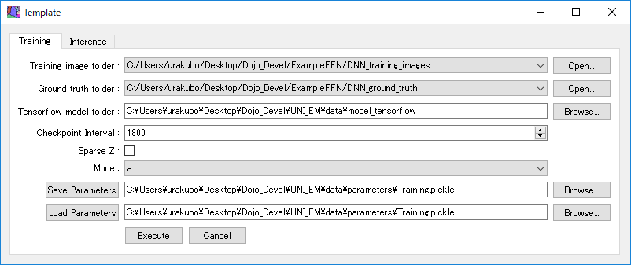

[Japanese version here](HowToMakePlugin.ja.md)

## How to make a plugin
Users can easily embed their own executable program (including a Python program) in UNI-EM as a plugin. Here we show how to make such a plugin by tracing a pre-installed template. The template plugin executes an external Python program "run_example.py" located at UNI_EM\plugins\Template. First, check the contents of UNI_EM\plugins\menu.json that defines the Plugin dropdown menu.
```json
{
"2D/3D Filters": {
	"Sub":		0,
	"Func":		"Filters2D3D"
},
"Template": {
	"Sub":		0,
	"Func":		"Template"
},
"User Defined1": {
	"Sub":		1,
	"Func":		"UserDefined_"
},
"User Defined2": {
	"Sub":		0,
	"Func":		"UserDefined_"
},
}
```
Where the keys at a highest level (e.g., "2D/3D Filters") correspond to the contents of the dropdown menu, and the key "Sub" specifies the number of lower-level contents that are subsequently generated. The key "Func" specifies the functions that are called in UNI_EM\plugins. Here, check the content of UNI_EM\plugins\Template\Template.py. The class GenerateDialog is automatically called to create a dialog (Widget).
```python
from Template.Training   import Training
from Template.Inference  import Inference

class GenerateDialog(QWidget, MiscellaneousTemplate):
    def __init__(self, parent):
        self.title  = "Template"
	...
        self.initUI()

    def initUI(self):
	# Training
        training        = Training(self.u_info)
        tab_training    = self.GenerateTabWidget(training)
        tabs.addTab(tab_training, 'Training')

        # Inferernce
        inference        = Inference(self.u_info)
        tab_inference    = self.GenerateTabWidget(inference)
        tabs.addTab(tab_inference, 'Inference')
```
Template.py imports Training.py and Inference.py in the first two lines, and initUI assigns them to objects. One of the classes UNI_EM\ plugins\Template\Training.py can be read as follows:
```python
##
exec_dir = os.path.join(main_dir, 'plugins','Template')
exec_template = 'python ' + os.path.join(exec_dir, 'run_example.py')
##

class Training(MiscellaneousTemplate):
    def _Run(self, params, comm_title):
        ##
        comm_run = exec_train + ' ' \
                     + ' --training_image_folder '    + params['Training image folder'] + ' ' \
                     + ' --ground_truth_folder '      + params['Ground truth folder'] + ' ' \
                     + ' --tensorflow_model_folder ' + params['Tensorflow model folder']  + ' ' \
        s.run(comm_run.split())

    def __init__(self, u_info):
    	##
        self.name = 'Training'
        self.tips = [
                        'Checkpoint Interval',
                        'Sparse Z',
                        'Mode',
                        'Input : Training image folder',
                        'Input : Ground truth folder',
                        'Input/Output: Tensorlflow Model Folder'
                        ]

        self.args = [
                        ['Checkpoint Interval', 'SpinBox', [100, 1800, 65535]],
                        ['Sparse Z', 'CheckBox', False],
                        ['Mode', 'ComboBox', ['a','b','c']],
                        ['Training image folder'   , 'LineEdit', training_image_path  , 'BrowseDirImg'],
                        ['Ground truth folder'     , 'LineEdit', ground_truth_path   , 'BrowseDirImg'],
                        ['Tensorflow model folder' , 'LineEdit', tensorflow_file_path  , 'BrowseDir'],
            ]
```
where the global variable exec_template holds the name of the target external program, i.e.,  
exec_template="python UNI_EM\plugins\Template\run_example.py." The function _Run associates exec_template.py with arguments and executes it (s.run). The arguments are set through a control panel (Widget) that is specified by the variables self.arg, self.tips, and self.name. For example, in the first line, self.arg generates QSpinBox for setting a parameter entitled "Checkpoint Interval" under min=100, max=65535, and the default value=1800. The variable self.tips denotes the tool tips that appear when the cursor point is located on the titles. If the Training class is successfully read by the subsequent GenerateTabWidget, the control panel appears as below. Users can set parameters through the control panel, and execute it simply by pressing the execute button.

<BR>
<p align="center">
  
</p>
<BR>　

