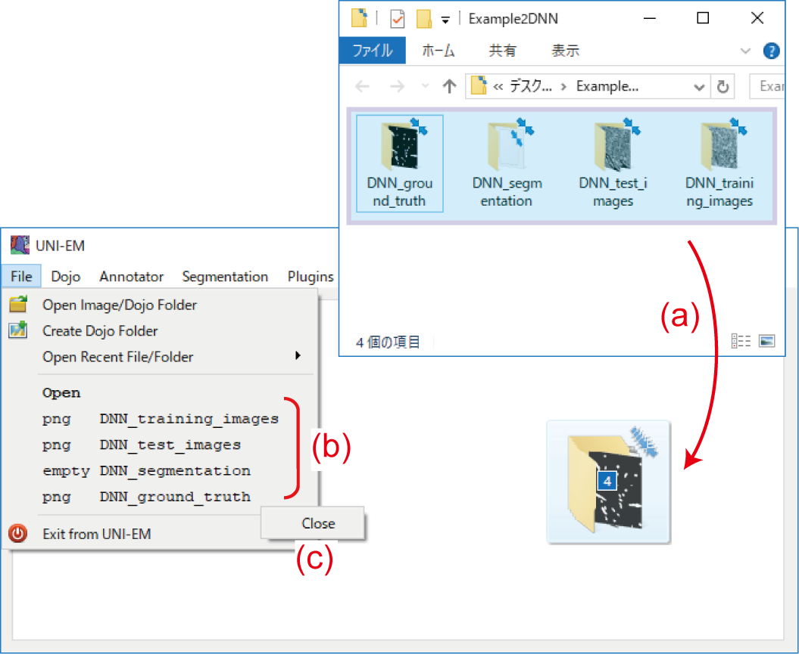
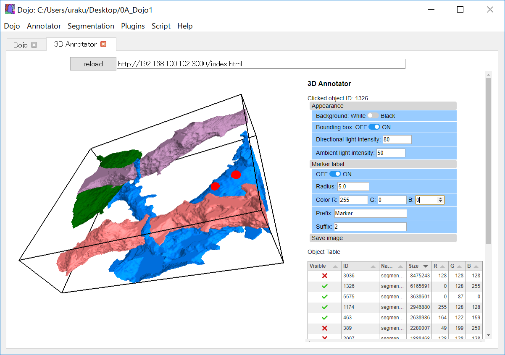
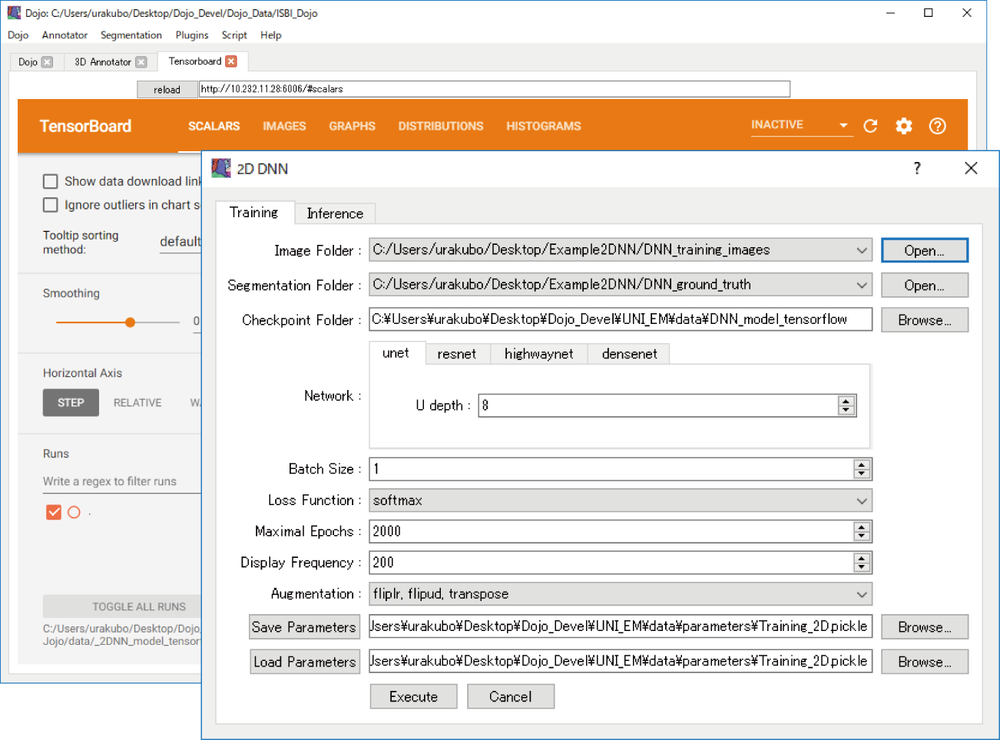
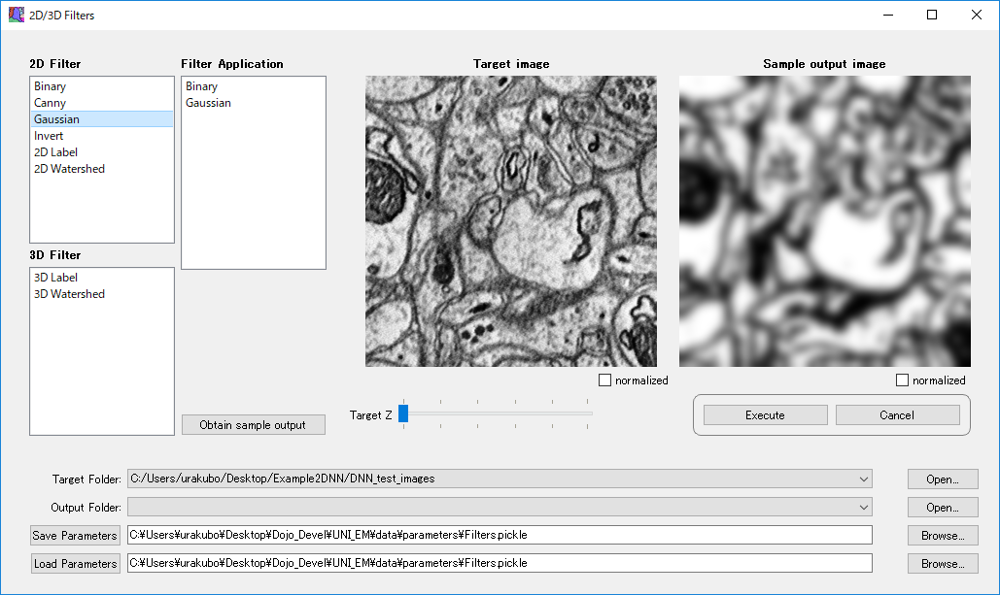

[Japanese version here](HowToUse.ja.md)

- [How to use: Folder management system](HowToUse.md#Folder-management-system)
- [How to use: Dojo proofreader](HowToUse.md#Dojo-proofreader)
- [How to use: 3D annotator](HowToUse.md#3D-annotator)
- [How to use: 2D CNN](HowToUse.md#2D-CNN)
- [How to use: 3D FFN](HowToUse.md#3D-FFN)
- [How to use: 2D and 3D filters](HowToUse.md#2D3D-Filters)
- [Example workflow1: Mitochondria segmentation using 2D DNN](Workflow1.md)
- [Example workflow2: Membrane segmentation using 3D FFN](Workflow2.md) 

## How to use

### Folder management system：
UNI-EM can open folders that contain tiff/png consecutive image files, Dojo style files, and the other types of files (Figure). Drag and drop target folders (a), then they are open. The opened folders appear in the file dropdown menu (b), which is callable from UNI-EM programs. Users can open up to 6 folders simultaneously. Click left mouse button on a opened folder to close it (c).

 

  

 

### Dojo proofreader
This is a proofreading software as a part of Rhoana pipeline (Copyright, Lichtman/Pfister lab, Harvard, USA). We extend Dojo for wider use.

	- https://www.rhoana.org/dojo/

1. Select Dojo → Open Dojo Folder from the dropdown menu, and specify the folder of sample EM/segmentation dojo files. Dojo will be launched as a web application.
2. Please push the "Reload" button first if Dojo is in trouble. Dojo can also be seen in the other web browser if users copy and paste the URL ( e.g., [ http://X.X.X.X:888X/dojo/ ] ). Users can also use Dojo through the web browsers of other PCs within the same LAN.
3.	The usage of Dojo is described in the original web page [ https://www.rhoana.org/dojo/ ] . For example, users can move between layers by pressing w/s keys, and change the opacity of segmentation by pressing c/d keys.
4.	Users can create a Dojo folder from a pair of new EM images and segmentation. Select File → Create Dojo Folder. Specify the folders containing a stack of EM images and a stack of segmentation images through the dialog (sequentially numbered, gray-scale png/tiff files).
5.	The edited segmentation images can be exported as sequentially numbered, gray-scale png/tiff files, by selecting Dojo → Export EM Stack / Export. 

 

  

 

### 3D annotator
Select Annotator → Open in the dropdown menu. The 3D Annotator will be launched.

1.	Check red crosses in the object table of the right side. The checked objects will appear in the left side. Objects in the object table can be re-ordered by size, and users can see visible big objects by clicking the red crosses of large size objects.
2.	The appeared objects can be rotated, panned, zoomed in/out with the mouse, and their names and colors (RGB) can be changed though the object table.
3.	Users can control the background color, bounding box, and light projection through the accordion menu "Appearance".
4.	The edited contents of the object table can be saved by clicking the button under the object table (CSV).

Turn on the toggle switch in the accordion menu 'Marker label' (right side), then click on any appeared objects. Users will see red markers at the clicked surface location. 

1.	The appeared markers are registered in the marker table. Their colors (RGB), names, radiuses, and deletion can be controlled through the marker table.
2.	Users can also define the colors, names, and numbers of next makers through the accordion menu "Marker label" (right side).
3.	The edited contents of the marker table can be saved by clicking the download button under the marker table (CSV).

Click the "Save image" button at the right side. A screenshot of the scene will be saved as "Screenshot.png".

 

  

 

### 2D CNN
We implemented 2D CNN (Resnet/U-net/Highwaynet/Densenet)-based segmentation programs.

	- https://github.com/tbullmann/imagetranslation-tensorflow

#### Requirements. 
1.	one-page ground truth with 512 x 512 xy-pixels.
2.	Six min training period with a NVIDIA-GPU card (in the case of GTX1070).

The VAST Lite is recommended for the ground truth generation (https://software.rc.fas.harvard.edu/lichtman/vast/ ).

#### Procedure:
1.	Select Segmentation → 2D DNN in the pulldown menu. A dialog that has the two tabs appears: training and inference.
2.	Select the training tab and specify parameters:
	- Image Folder:	Folder containing EM images (tiff/png images).
	- Segmentation Folder: Folder containing ground truth segmentation (tiff/png images).
	- Checkpoint folder: The CNN model will be stored.
	- Generator:	"unet", "resnet", "highwaynet", "densenet"
	- Loss function:"hinge", "square", "softmax", "approx", "dice", "logistic"
	- Augmentation:	{fliplr  ,flipud, transpose} 
	- Maximal epochs
	- Display Frequency
	- Save Parameters
	- Load Parameters
3. Execute training. The default parameters target a sample EM image "[UNI-EM]/data/DNN_ground_truth/49.png" and segmentation image "[UNI-EM]/data/DNN_training_images/49.png".
4. Select Segmentation → Tensorboard to inspect the progression of training. It took 5 min for the training of sample data by use of NVIDIA GeForce GTX 1070.
5. The console window shows the end of training as "saving model".
6. Confirm the connectivity file "model-XXXXX.data-XXXXX-of-XXXXX" (800 MB) in the checkpoint folder. 
9. Select Segmentation → 2D DNN, and set the parameters of the inference tab.
	- Image Folder:	Folder containing EM images (tiff/png images).
   	- Output Segmentation Folder 
	- Checkpoint 
10. Execute inference.
11. Check that the inference results are stored in the Output Segmentation Folder (Dojo_Standalone/data/DNN_segmentation by default).

 

  

 

### 3D FFN
Here, we wrapped an excellent membrane segmentation program that was developed by Dr. Michał Januszewski et al. : flood filling networks (FFN, Nature Methods, vol. 15 (2018), pp. 605-610 ; https://github.com/google/ffn ). The FFN, which is a recurrent 3D convolutional network, directly produce 3D volume segmentation with high precision. 

#### Requirements. 
1.	3D ground truth of 512 x 512 xy-pixels and over 50 Z-slices.
2.	Long training period (-1 weeks) with a high-performance NVIDIA-GPU card (GTX1080ti or higher).

The VAST Lite is recommended for the ground truth generation (https://software.rc.fas.harvard.edu/lichtman/vast/ ).

#### Procedure:
1.	Select Segmentation → 3D FFN in the pulldown menu. A dialog that has the four tabs appears: Preprocessing, Training, Inference, and Postprocessing.
2.	Select the preprocessing tab and specify parameters:
	- Image Folder:	Folder containing EM images (grayscale sequential tiff/png images).
	- Ground Truth Folder: Folder containing ground truth segmentation (grayscale sequential tiff/png images).
	- FFN File Folder: 	Folder storing generated files for training.
	- Save Parameters
	- Load Parameters

	By default, "Image Folder" indicates [UNI-EM
	]/data/DNN_training_images, and "Ground Truth Folder" indicates [UNI-EM]/data/DNN_ground_truth.
	Users will see an example EM image volume and their segmentation (kasthuri15) by downloading the following example data.
	- ExampleFFN.zip 522MB: https://www.dropbox.com/s/cztcf8w0ywj1pmz/ExampleFFN.zip?dl=0

3.	Execute the preprocessing. It takes 5 to 60 min depending on the target image volume and machine speed. It produces the three files in the FFN file folder: af.h5, groundtruth.h5, and tf_record_file .
4.	Select the training tab and specify parameters:
	- Max Training Steps: 	The number of training FFN, a key parameter.
	- Sparse Z:	Check it if the target EM-image stack is anisotropic. Internally, 
	- Training Image h5 File:	Generated file
	- Ground truth h5 File:		Generated file.
	- Tensorflow Record File:	Generated file.
	- Tensorflow Model Folder:	Folder storing training results.
5.	Execute the training. It requires over a few days depending on the target image volume, machine speed, and the Max Training Steps. A few million training steps are required for minimal quality inference. Users can execute additive training by specifying the same parameter settings with the increasing number of "Max Training Steps".
6.	Select the inference tab and specify parameters:
	- Target Image Folder:	Folder containing EM images (sequential grayscale tiff/png images).
	- Output Inference Folder: Folder that will store the inference result.
	- Tensorflow Model Files: Specify the trained model files. Please remove their suffix, and just specify the prefix such as "model.ckpt-2000000."
	- Sparse Z:	Check if it was checked it at the training process.
	- Checkpoint interval: Checkpoint interval.
	- FFN File Folder: Folder storing generated files for inference "inference_params.pbtxt."
	- Save Parameters
	- Load Parameters
7.  Execute the inference. It requires 5-60 min depending on the target image volume and machine speed. It produces the inference results "0/0/seg-0_0_0.npz " and " seg-0_0_0.prob " in the Output Inference Folder. It also produces "inference_params.pbtxt" in the FFN file folder.
8.  Select the postprocessing tab and specify parameters:
	- Target Inference File: Specify inferred segmentation file such as seg-0_0_0.npz.
	- Output Inference Folder: Folder storing generated sequential image files.
	- OUtput Filetype: Please select one of them. 16 bit images are recommended.
	- Save Parameters
	- Load Parameters
9.  Execute the postprocessing. It generally requires less than 5 min. It produces the inference result in the Output Inference Folder.
10. Check the quality of segmentation (inference) by use of colored images or Dojo proofreader.

### 2D/3D Filters
UNI-EM has a variety of 2D and 3D image filters. Select Plugins → 2D/3D Filters in the dropdown menu of UNI-EM. The dialog of 2D/3D Filters will appear.

1.	Specify "Target Folder" and "Output Folder" at the bottom of the Dialog. The target folder contains target images applied to filters, and the filtered images are stored in the output folder. Confirm that the target images appear in the area "Target Image."
2.	Drug a filter from "2D Filter" or "3D Filter" and drop it in "Filter Application". If users apply multiple filters, drug and drop them to "Filter Application".
3.	Specify filter parameters. Parameter setting widget appears if users click the parameter in "Filter Application".
4.	Click "Obtain sample output" to obtain a sample output image after the filter application. Repeat trial-and-error until obtaining a required image.
5.	Click "Execute". The filter(s) are applied to the images in "Target Folder", and the outputs are stored in "Output Folder."
6.	Click "Save Parameters" and "Load Paraemters" to save and load the parameter setting.
7.	Check "Normalized" then image intensity is normalized for visibility.

 

  

 

