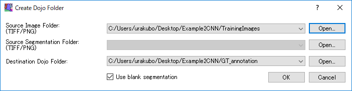
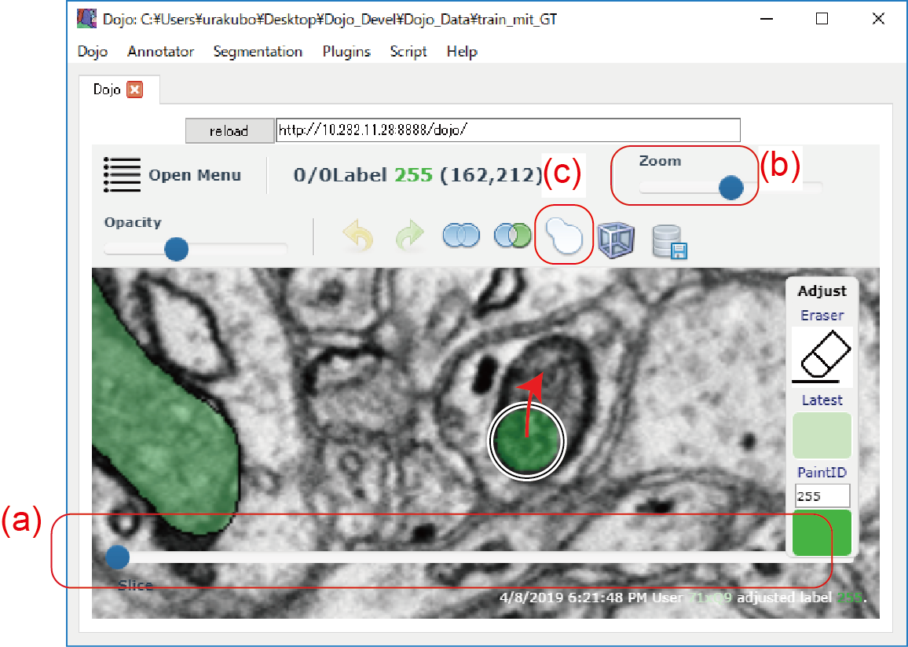
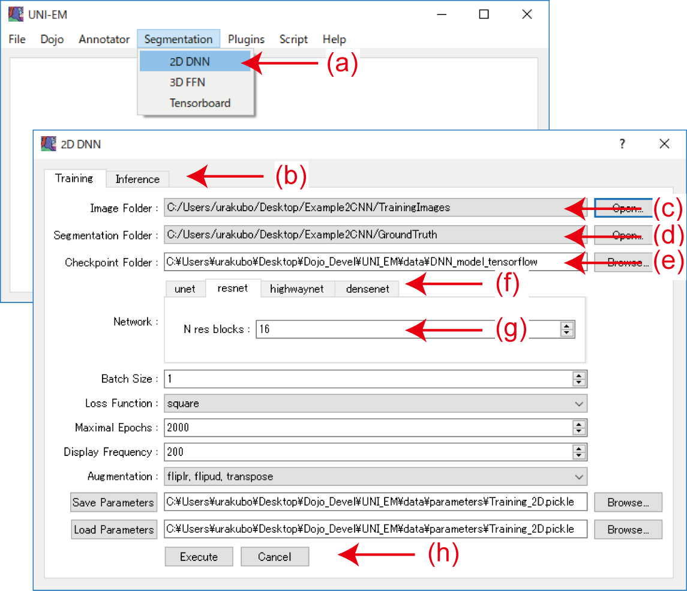

[Japanese version here](Workflow1.ja.md)

- [How to use: Folder management system](HowToUse.md#Folder-management-system)
- [How to use: Dojo proofreader](HowToUse.md#Dojo-proofreader)
- [How to use: 3D annotator](HowToUse.md#3D-annotator)
- [How to use: 2D CNN](HowToUse.md#2D-CNN)
- [How to use: 3D FFN](HowToUse.md#3D-FFN)
- [How to use: 2D and 3D filters](HowToUse.md#2D-and-3D-filters)
- [Example workflow1: Mitochondria segmentation using 2D CNN](Workflow1.md)
- [Example workflow2: Membrane segmentation using 3D FFN](Workflow2.md) 


## Example workflow 1: Mitochondria segmentation using 2D DNN

Here we try automated mitochondria segmentation of a stack of EM images using a 2-dimentional deep neural network (2D DNN). The target EM stack was obtained by Kasthuri et al. ( Cell 162(3):648-61, 2015 ). The target brain region is mouse somatosensory cortex, and they were obtained by use of an automatic tape-collecting ultra-microtome system (ATUM) for SEM imaging (ATUM/SEM).  The EM stack was originally arranged for ISBI 2013 challenge ([SNEMI3D](http://brainiac2.mit.edu/SNEMI3D/)). The EM images are open to public under Open Data Commons Attribution License (ODC-By) v1.0. The original images were passed through the Contrast Limited Adaptive Histogram Equalization filter (CLAHE; blocksize 127,　Histogram bins 256, max slope 1.50).

- https://neurodata.io/data/kasthuri15/
- https://opendatacommons.org/licenses/by/1-0/
- http://docs.neurodata.io/kasthuri2015/kasthuri15docs.html


#### Preparation of ground truth

Download "Example2DNN.zip" from the link below and unzip it on your UNI-EM installed PC. Replace the unzipped folders with the contents of the "data" folder in UNI-EM ([UNI-EM]/data). The folder "[UNI-EM]/data/DNN_training_images" contains a training image, and the folder "[UNI-EM]/data/DNN_ground_truth" contains a ground truth segmentation (**Fig. 1.1**).  Users can use this ground truth image (see from No. 2), or draw the ground truth using Dojo by themselves as stated below.

- "Example2DNN.zip": https://www.dropbox.com/s/k1baokh6yz1ucjk/Example2DNN.zip?dl=0

<BR>
<p align="center">
  
</p>
<p align="center">
  <font size="5"> <b>Figure 1.1. Training EM image and mitochondria ground truth segmentation</b> </font>
</p>
<BR>

- Launch UNI-EM.

- Select Dojo → Import EM Stack/Segmentation from the dropdown menu. The dialog "Import Images & Segments" will appear (**Fig. 1.2**)。

- Set the Source Image Folder as **"[UNI-EM]/data/DNN_trainig _images"**.
- Check the Use blank segmentation box. The section "Source Segmentation Folder" will be disabled.
- Specify the Destination Dojo Folder. Generated Dojo files will be stored in this folder.
<BR>
<p align="center">
  
</p>
<p align="center">
  <font size="5"> <b>Figure 1.2. Importing a training image to Dojo</b> </font>
</p>
<BR>

- Click the OK button. Dojo files will be generated, then Dojo will be launched (**Fig. 1.3**).
- Confirm the usage of Dojo by controlling the Slice bar (**Fig. 1.3a**) and Zoom bar (**Fig. 1.3b**), etc.
- Click the Adjust button whose shape has a fused two area (**Fig. 1.3c**). A control panel will appear. Keep the number of PaintID as 255, and click the color panel below. The circular cursor will appear. Its radius can be changed by pressing the [=/-] key. Paint mitochondria using this cursor (**Fig. 1.3** red arrow). Press Tab key to accept the drawing, or discard it by pressing the Esc key. Users can erase mis-painting by dragging the cursor after clicking the eraser icon. Press Tab key to accept the erasure, or press Esc key to discard it.
- Save the mitochondria painting by selecting Dojo →Save Dojo Folder.
- Export the mitochondria painting by selecting Dojo →Export Segmentation in the dropdown menu. In the export dialog, select the file format "PNG, 8bit, Grayscale." Users can also input Filename. After pressing the OK button, users are requested to specify the saving folder. The painting segmentation image will be stored with the filename 0000.png. The painting image will be used for ground truth. Put this image at "[UNI-EM]/data/DNN_ground_truth".

<BR>
<p align="center">
  
</p>
<p align="center">
  <font size="5"> <b>Figure 1.3. Drawing ground truth segmentation</b> </font>
</p>
<BR>


#### Training and inference

2. Launch UNI-EM.

3. Select "Segmentation → 2DNN" from a UNI-EM dropdown menu to launch a dialogue that is named as 2D DNN (**Fig. 2a**).
	- Select Training tab (**Fig. 2b**).
	- Confirm that "Image Folder" targets [UNI-EM]/data/DNN_training_images (**Fig. 2c**), "Segmentation Folder" targets [UNI-EM]/data/DNN_ground_truth (**Fig. 2d**), and "Checkpoint Folder" targets [UNI-EM]/data/DNN_model_tensorflow (**Fig. 2e**).
	- Select "resnet" from the tab menu in the middle (**Fig. 2f**), and set "N res blocks" as 16 (**Fig. 2g**). This is because Resnet is one of the best network topologies for mitochondria segmentation (Ref 1).
	- Save all parameters by clicking "Save Parameters". The saved parameters are loaded by clicking "Load Parameters".

4. Start Res-net training by clicking the Execute button (**Fig. 2h**). Users will see initial and progress messages in the console window (shown below). It takes 6-min for a desktop PC equipped with a NIVIDA GTX1070 GPU. The console window shows a message "saving model" when the training is finished. During and after the training period, users can visually inspect its progression through Tensorboad by selecting "Segmentation → Tensorboard".
```2D DNN Training
        progress  epoch 49  step 1  image/sec 5.2  remaining 6 min
        discrim_loss 0.49639216
        gen_loss_GAN 0.41848987
        gen_loss_classic 0.13485438
        recording summary
        progress  epoch 99  step 1  image/sec 5.5  remaining 5 min
        discrim_loss 0.69121116
        gen_loss_GAN 0.73412275
        gen_loss_classic 0.13613938
        ...
        ...
        progress  epoch 1999  step 1  image/sec 7.3  remaining 0 min
        discrim_loss 0.715416
        gen_loss_GAN 2.1579466
        gen_loss_classic 0.04729831
        saving model
```
5. Select the inference tab in the 2D DNN dialogue (**Fig. 2b**).
	- Confirm that "Image Folder " targets [UNI-EM]/data/DNN_test_images, "Output Segmentation Folder" targets [UNI-EM]/data/DNN_segmentation, and "Checkpoint Folder" targets [UNI-EM]/data/DNN_model_tensorflow.

6. Start inference by clicking the "Execute" button in the Inference tab. Users will see initial and progress messages in the console window (shown below). Users will see "evaluated image 0099" when Inference is finished.
```2D DNN Inference
        parameter_count = 68334848
        loading all from checkpoint
        evaluated image 0000
        evaluated image 0001
        evaluated image 0002
        ...
        ...
        evaluated image 0097
        evaluated image 0098
        evaluated image 0099
```
7. Confirm that the "Output Segmentation Folder" ( [UNI-EM]/data/DNN_segmentation ) contains 0000.png, 0001.png, ..., 0099.png .

<p align="center">
  
</p>
<p align="center">
  <font size="5"> <b>Figure 2. 2D DNN training dialog</b> </font>
</p>
<BR>


#### Postprocessing: Binarization and 3D labeling

8. Select "Plugins → 2D/3D Filters" from the dropdown menu. The 2D/3D filters dialog will appear (**Fig. 3**)。
	- Drag Binary and 3D Label to the area of "Filter Application" (**Fig. 3a**).
	- Confirm that "Target Folder" shows [UNI-EM]/data/DNN_ segmentation (**Fig. 3b**).
	- Confirm that "Output Folder" shows [UNI-EM]/data/DNN_segmentation (**Fig. 3c**).
	- Confirm that the thumbnail image of the images in "Target Folder" appears in the area "Target image" (**Fig. 3d**). Press the Obtain sample output button (**Fig. 3e**), then see an example output after passing those two image filters (**Fig. 3f**).

9. Click the Execute button, then the filters "binarization → 3D labeling" will be applied (**Fig. 3g**). Users will see the following progress messages, and the processed images will be stored in "Output Folder" .
```
	Loading images ...
	Saving images ...
	2D/3D filters were applied!
```

<p align="center">
  
</p>
<p align="center">
  <font size="5"> <b>Figure 3. 2D/3D Filters</b> </font>
</p>
<BR>


#### Proofreading, annotation, and visualization

10. Select "Dojo → Import EM Stack/Segmentation" from the UNI-EM dropdown menu to launch the dialogue "Import Images & Segments".
	- Set "Source Image Folder" as **[UNI-EM]/data/DNN_test_images** .
	- Set "Source Segmentation Folder" as **[UNI-EM]/data/DNN_segmentation** .
	- Create a file folder and set it as "Destination Dojo Folder". Dojo style files will be generated in this folder.

11. Generate the Dojo style files by clicking the "OK" button. The software Dojo will be launched after the file generation (**Fig. 4a**).

12. Inspect successful segmentation visually through manipulating the bottom slice bar (**Fig. 4b**), top Zoom bar (**Fig. 4c**), and top Opacity bar (**Fig. 4d**).

13. Correct erroneous segmentation by entering the mode "Adjust". Click an icon whose shape has a fused two area (**Fig. 4e**). In the adjust mode, users can fill voids by dragging the circled cursor from a filled area. The =/- keys change its radius. Press the Tab key to verify the change, or the Esc key to cancel the change. Users can erase unnecessary areas by dragging the circled cursor after clicking the eraser icon (**Fig. 4f**).

14. Save the segmentation after proofreading. Users can also export the segmentation by selecting "Dojo → Export Segmentation" from the UNI-EM dropdown menu. The export file style is sequential png/tiff images.

15. Select "Annotator → Open" from the UNI-EM dropdown menu to launch the 3D Annotator. Users can visually inspect the 3D shapes of target objects, save 3D images, annotate the target objects, and locate markers (**Fig. 4g**). Refer [3D Annotator](../README.md#3D-Annotator) for detail.

<p align="center">
  
</p>
<p align="center">
  <font size="5"> <b>Figure 4. Proofreader Dojo and 3D Annotator</b> </font>
</p>

<BR><BR>

- (Ref1) Dr. Torsten Bullmann conducted a parameter survey for the best segmentation of mitochondria, membranes, and PSDs.
	- <https://github.com/tbullmann/imagetranslation-tensorflow>
